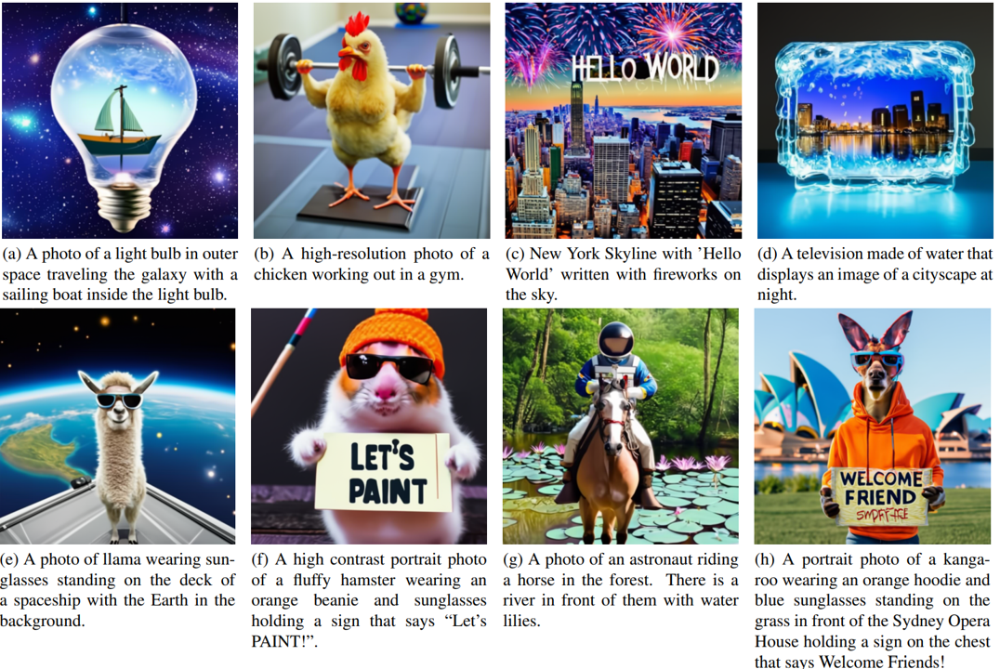

# Shifted Diffusion for Text-to-image Generation

  

Code for [Shifted Diffusion for Text-to-image generation](https://arxiv.org/abs/2211.15388) (CVPR 2023).

Shifted Diffusion is a new diffusion model designed to better generate image embeddings from text.

  

("Decoder" can be either diffusion-based or GAN-based model, you can also make it conditioned on both image embedding and text.)

With Shifted Diffusion, you can
- improve your text-to-image generation model by introducing an extra image embedding input ([see section 5.1](https://arxiv.org/pdf/2204.06125.pdf));
- train or fine-tune a text-to-image generation model on image-only dataset (so-called [language-free setting](https://arxiv.org/abs/2111.13792));

Below we provide examples of using our Shifted Diffusion.

<strong> Don't forget to create a new conda environment in advance.</strong>

## Get started

Install some dependencies

    pip install -r ./requirements.txt
    pip install git+https://github.com/openai/CLIP.git
    cd ./diffusers
    pip install -e .
    cd ..
    wget "https://openaipublic.azureedge.net/clip/models/8fa8567bab74a42d41c5915025a8e4538c3bdbe8804a470a72f30b0d94fab599/RN101.pt"
    wget "https://openaipublic.azureedge.net/clip/models/40d365715913c9da98579312b702a82c18be219cc2a73407c4526f58eba950af/ViT-B-32.pt"
    wget "https://openaipublic.azureedge.net/clip/models/5806e77cd80f8b59890b7e101eabd078d9fb84e6937f9e85e4ecb61988df416f/ViT-B-16.pt"
    accelerate config
    
To train a Shifted Diffusion model, run (choose hyper-parameters based on your device)

    accelerate launch --mixed_precision="fp16" train.py
 
We provide our pre-trained Shifted Diffusion models [here](https://drive.google.com/drive/folders/1yix-GwcoxKxq6-sZwMK9xEv4lW8nWUas?usp=sharing).

## Shifted Diffusion + Stable Diffusion

We provide a simple example which combines our pre-trained Shifted Diffusion with [Stable Diffusion 2](https://github.com/Stability-AI/stablediffusion).

Specifically, a projection layer is added, which maps input image embedding into 4 word embeddings. Feel free to try more complicated architectures.

With the example below, one can first fine-tune a Stable Diffusion model on image-only dataset (language-free setting), 
then 
- directly input an image to perform <strong> image-to-image </strong> generation;
- directly plug in our pre-trained Shifted Diffusion model and perform <strong> text-to-image </strong> generation;
  

### Fine-tune a Stable Diffusion model

Prepare an image-only dataset ([MS-COCO](https://cocodataset.org/#home) for example)

    wget http://images.cocodataset.org/zips/train2014.zip
    unzip train2014.zip
    python process_img.py --src=./train2014 --size=512 --dest=./train2014

Run 
    
    accelerate launch --mixed_precision="fp16" finetune.py\
      --pretrained_model_name_or_path="stabilityai/stable-diffusion-2-base" \
      --train_data_dir=./train2014/ \
      --use_ema \
      --resolution=512 --center_crop --random_flip \
      --train_batch_size=8 \
      --gradient_accumulation_steps=1 \
      --gradient_checkpointing \
      --max_train_steps=30000 \
      --checkpointing_steps=5000\
      --learning_rate=1e-05 \
      --max_grad_norm=1 \
      --lr_scheduler="constant" --lr_warmup_steps=0 \
      --output_dir="./finetuned_coco"

(We did not optimize hyper-parameters, hyper-parameters follow [examples here](https://github.com/huggingface/diffusers/tree/main/examples))

[Here are some slightly fine-tuned Stable Diffusion 2 models](https://drive.google.com/drive/folders/1ZNR15C9I-Bx7jH-yoTa_RqnXMEJv0qQ5?usp=share_link), we used a total batch size of 8 * 8 * 1 = 64. 
      
### Test fine-tuned Stable Diffusion model

<strong>Generate image with CLIP image embedding</strong>

Run

    python test.py
    
Examples of input/generated images on different datasets:

 
    
     &emsp;
    
    

    

 
    
     &emsp;
    
    

 
 

<strong>Generate image with text + Shifted Diffusion</strong>

Run

    python sft_test.py

Below we provide a comparison.
 

     
    

A ground-truth image-text pair is shown, obtained from MS-COCO dataset. 

Although Stable Diffusion 2 is able to perform zero-shot generation, the generation may not satisfy our requirement in terms of style, etc.

With our language-free fine-tuning and pre-trained Shifted Diffusion model, we are able to generate desired images. 

This approach can be easily applied to different domains/datasets, <strong>no image-text pair is needed </strong> in fine-tuning. 

Below is a comparison between shifted diffusion and baseline diffusion on fine-tuned Stable Diffusion 2 model, where we evaluate the FID score and CLIP similarity (average similarity from CLIP ViT-B/16, ViT-B/32, RN-101) between generated images with input text/ground-truth target image.

     
      
    

## Shifted Diffusion + Lafite
The decoder can also be GAN-based models, e.g. [Lafite](https://github.com/drboog/Lafite). 

Similar to the example above, one need to construct an image-only dataset, then train a mapping which maps image embeddings to images. 

After training of GAN, directly utilize pre-trained Shifted Diffusion model to perform text-to-image generation at inference.

## Citation
    @article{zhou2022shifted,
      title={Shifted Diffusion for Text-to-image Generation},
      author={Zhou, Yufan and Liu, Bingchen and Zhu, Yizhe and Yang, Xiao and Chen, Changyou and Xu, Jinhui},
      journal={arXiv preprint arXiv:2211.15388},
      year={2022}
    }